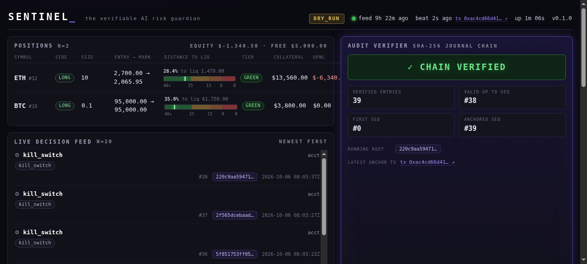
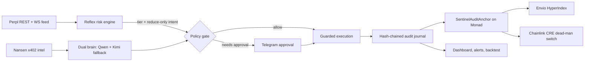

# Sentinel

> The first verifiable, non-custodial AI risk guardian for perpetual futures — deterministic reflexes, Qwen/Kimi strategic judgment, every action provable on-chain




> Demo GIF: **pending** (P18).

Sentinel is a non-custodial guardian for isolated-margin perpetual futures on [Perpl](https://app.perpl.xyz) (Monad). It watches positions, decides defensively, and de-risks with reduce-only orders — and it is built so that every decision can be verified after the fact: a hash-chained audit journal, anchored on-chain, indexed for anyone to query, with an independent dead-man's switch in case Sentinel itself goes silent.

---

## The Problem

**Isolated margin removes the safety net.** In cross-margin trading, a shared account balance absorbs losses across positions. In isolated margin — the model Perpl uses — each position lives on its own collateral: free balance elsewhere in the account does **not** protect it ([docs/FACTS.md](docs/FACTS.md) §1.7). A single position can march toward liquidation while the trader sleeps, and the liquidation price is not even handed to you by the gateway: it must be derived from first principles (`entry + side × (MMR − collateral) / size`) and cross-checked against the exchange ([docs/FACTS.md](docs/FACTS.md) §1.7).

**And a liquidation doesn't need a crash.** A gap through the liquidation level settles the position before a human can click anything — see the `gap-through-liq` scenario in [docs/backtest-report.md](docs/backtest-report.md). In the same backtest, the do-nothing baseline ends in **11 liquidations across 14 scenarios**; with Sentinel, **0**. But "we would have saved you" is worthless without proof — especially when the guardian is an AI. That is the second half of the problem: an automated guardian has to be *auditable*, or no one should trust it with a position.

## The Solution

Sentinel runs **two brains**:

- The **reflex brain** is deterministic — no LLM anywhere in the path. It evaluates every position on every tick ([crates/sentinel-core/src/risk.rs](crates/sentinel-core/src/risk.rs)) with classification measured at **0.271 µs per iteration** (10k iterations in 2.707756 ms; 2200 intents — [docs/evidence/p04-skill-verification.txt](docs/evidence/p04-skill-verification.txt)) and can de-risk a position the moment a tier breach is detected.
- The **strategy brain** is LLM-powered — Alibaba **Qwen** primary, Moonshot **Kimi** fallback — consulted only at Yellow/Orange transitions and portfolio reviews. It proposes; the policy engine disposes.

Two invariants are structural, not aspirational: **the reflex never calls an LLM**, and **the LLM never bypasses the policy gate** ([docs/architecture.md](docs/architecture.md)).

**The five pillars**

1. **Deterministic reflex risk engine** — distance-to-liquidation from first principles with exchange-value preference, margin health, tier classification, reduce-only intents. No network, no clock, no unsafe code in the pure core.
2. **Dual-brain strategy** — versioned prompts, strict JSON decisions, one repair nudge, confidence floor, per-slot circuit breakers, and a failover that is tested by force-failing the primary ([docs/evidence/p08-failover.txt](docs/evidence/p08-failover.txt)).
3. **Policy gate & custody guardrails** — reduce-only by construction, caps and allowlists, human approval above a notional threshold (Telegram), idempotent order retries, kill switch, and secrets that never touch logs (`SecretString`, redacting `Debug`).
4. **Verifiable audit spine** — an append-only hash-chained journal; decision batches anchored to the on-chain `SentinelAuditAnchor` contract on Monad; an Envio indexer for public queries; and a Chainlink CRE dead-man's switch that can de-risk even if Sentinel itself stops heartbeating ([docs/evidence/p10-anvil-e2e.txt](docs/evidence/p10-anvil-e2e.txt), [docs/evidence/p14-breaker-demo.txt](docs/evidence/p14-breaker-demo.txt)).
5. **Operator surface & evidence** — a single-file dashboard with a live decision feed and a chain verifier (61,807 bytes, zero external requests; kill-switch round-trip verified — [docs/evidence/p15-validate.txt](docs/evidence/p15-validate.txt), [screenshots](docs/evidence/p15-dashboard-positions-feed.png)), Telegram approvals and alerts, and a deterministic backtester + replay.



**Built to be checked:** 38 suites / 878 tests OK; `clippy -D warnings` rc=0; `cargo fmt --check` clean ([docs/evidence/p16-validate.txt](docs/evidence/p16-validate.txt)).

## Live links

Public endpoints land with their deploys; until then, every cell stays honest:

| Surface | Link | Status |
|---|---|---|
| Dashboard (hosted) | `pending` | STUB-24 — Railway deploy needs an interactive account. Local: `docker compose up` then `http://localhost:8080` (screenshot above) |
| Envio GraphQL (cloud) | `pending` | STUB-20 — needs an Envio Cloud login; local anvil proof in [docs/evidence/p12-envio-anvil.txt](docs/evidence/p12-envio-anvil.txt) |
| Anchor contract (Monad testnet explorer) | `pending` | STUB-17 — deploy needs a funded wallet; local anvil e2e in [docs/evidence/p10-anvil-e2e.txt](docs/evidence/p10-anvil-e2e.txt) |
| Demo / pitch video | `pending` | P18 — recording pending |

Statuses are tracked in [docs/STUBS.md](docs/STUBS.md) and updated as each item lands.

## Quickstart

### Docker Compose (daemon + dead-man's switch)

```bash
cp .env.example .env    # placeholder values pass config validation; edit for live modes
docker build --build-arg SENTINEL_UID=$(id -u) --build-arg SENTINEL_GID=$(id -g) -t sentinel:p16 .
docker compose up -d    # sentinel + breaker, same image, shared ./data
curl -s http://localhost:8080/healthz
```

- The image is verified reproducible (digest `bdfa6a107a11`), runs as a non-root user, ships a healthcheck, and composes with journal seq-continuity across `up`/`down` cycles ([docs/evidence/p16-docker.txt](docs/evidence/p16-docker.txt), [docs/evidence/p16-verify.txt](docs/evidence/p16-verify.txt)).
- Live `DRY_RUN`/`TESTNET` modes fetch a signed account snapshot at startup — placeholder credentials stop the daemon at the first call, which is exactly why the compose verification pins the service to a deterministic replay ([docs/RUNBOOK.md](docs/RUNBOOK.md) §1.2).
- The breaker **fail-fasts** without `BREAKER_ANCHOR_ADDRESS`, `BREAKER_GUARDIANS` and `BREAKER_ARM_SECRET` — fill them in or leave that service off ([docs/RUNBOOK.md](docs/RUNBOOK.md) §1.3).
- Full operator procedures: [docs/RUNBOOK.md](docs/RUNBOOK.md). Credentials, wallets and network setup: [docs/SETUP-MANUAL.md](docs/SETUP-MANUAL.md).

### Zero-key local replay (no credentials, no Docker)

Everything below runs from a fresh clone with just the Rust toolchain (pinned in [rust-toolchain.toml](rust-toolchain.toml); the workspace `rust-version` floor lives in [Cargo.toml](Cargo.toml)):

```bash
cp .env.example .env    # placeholders are valid for smoke runs — no keys needed
cargo run --bin sentinel -- --replay tests/fixtures/perpl/crash-scenario.jsonl
```

This replays the crash scenario through the real decision path — offline and deterministic. The dashboard and `/healthz` are served on `http://localhost:8080` while it runs (health payload: `{"feed_age_s":…,"mode":"DRY_RUN","uptime_s":…,"version":"0.1.0"}`), journal entries land under `data/audit/`, and the daemon drains cleanly when the fixture ends. Want to watch the dashboard instead of blinking? Slow the replay down:

```bash
SENTINEL_MOCK_PACE=1 SENTINEL_MOCK_CAP_MS=3200 cargo run --bin sentinel -- --replay tests/fixtures/perpl/crash-scenario.jsonl
```

(the compose verification pins these values for a ~75 s replay cycle — [docs/evidence/p16-docker.txt](docs/evidence/p16-docker.txt)).

Reproduce the backtest report:

```bash
cargo run --bin backtest -- --scenario all --out docs/backtest-report
# defaults are identical: --scenario all, --out docs/backtest-report
```

The daemon takes exactly two flags — `--mode dry-run|testnet|mainnet` and `--replay <fixture.jsonl>` ([crates/sentinel/src/args.rs](crates/sentinel/src/args.rs)); the backtester takes `--scenario`, `--scenarios-dir`, `--mode`, `--out` ([crates/sentinel/src/bin/backtest.rs](crates/sentinel/src/bin/backtest.rs)).

## Bounties

### 1. Perpl API — the gateway client

**What we built.** A raw Rust client for the Perpl API gateway, implemented against the official API docs and Rust examples: Ed25519 API-key authentication (the 6-field REST canonical string and the `mt:29` WebSocket sign-in frame), live market/account/position state over REST + WS, and **reduce-only order submission** (`CloseLong`/`CloseShort` by construction) with at-most-once retry semantics — `rq` is seeded from the account's `lfr` and a same-`rq` re-send is the idempotency mechanism. A full `MockPerpl` feed makes the whole pipeline replayable offline.

**Why it fits.** Correct auth and a safe order path are the two places perp integrations fail; this is a direct, tested implementation of the gateway spec, with `perpl-sdk` used as a complement for on-chain state cross-checks ([docs/FACTS.md](docs/FACTS.md) §1.11).

Snippet — the canonical REST signing string ([crates/sentinel/src/perpl/auth.rs](crates/sentinel/src/perpl/auth.rs)):

```rust
/// Canonical REST string (pure; spec function).
pub fn canonical_rest(
    chain_id: u64,
    method: &str,
    target: &str,
    timestamp_ms: &str,
    nonce: &str,
    body: &[u8],
) -> String {
    let body_hash = hex::encode(Sha256::digest(body));
    format!("{chain_id}\n{method}\n{target}\n{timestamp_ms}\n{nonce}\n{body_hash}")
}
```

Snippet — the reduce-only order spec, signed byte-exactly and sent once ([crates/sentinel/src/execution/perpl.rs](crates/sentinel/src/execution/perpl.rs)):

```rust
/// One signed POST of `{"d":[OrderSpec]}`; single attempt, no retry.
async fn submit(&self, order: &OrderRequest) -> Result<ExecutionReport> {
    let seq = self.seq.next();
    let raw = raw_size(order)?;
    let body = serde_json::to_vec(&json!({
        "d": [{
            "rq": seq,
            "mkt": order.market_id.0,
            "acc": self.account_id,
            "t": close_type(order.close),
            "p": 0,
            "s": raw,
            "fl": 0,
            "lv": 0,
            "lb": 0,
            "ms": order.max_slippage_bps,
        }]
    }))
    // … signed headers, single POST, mt:31 per-order status mapping
}
```

**Evidence.**

- DRY_RUN acceptance, from [docs/evidence/p05-dryrun-acceptance.txt](docs/evidence/p05-dryrun-acceptance.txt):
  `submit #1: Simulated id=sentinel-32-1 filled=2.500 avg=Some(2710.98630)` and `submit #2: suppressed as duplicate (window 60s, key 32:reduce:250)` — `acceptance rc=0`.
- Auth vectors verified against an independent Node Ed25519 oracle (REST + WS, `verify = true`; 26/26 adversarial) — [docs/evidence/p03-skill-verification.txt](docs/evidence/p03-skill-verification.txt).
- Golden-path replay screenshot: [docs/evidence/p06-golden-path.png](docs/evidence/p06-golden-path.png).
- Measured: DRY_RUN acceptance at **2710.98630**; idempotency key **32:reduce:250**.
- **PENDING:** live testnet reduce needs a venue key — STUB-09/STUB-12.

### 2. Perpl Analytics/Risk — the deterministic risk engine & backtester

**What we built.** A pure risk core that derives liquidation prices from isolated-margin first principles (with the exchange's value preferred when present), computes margin health and distance-to-liquidation in percent, classifies positions into Green/Yellow/Orange/Red tiers, and turns breaches into reduce-only intents. On top of it, a deterministic backtester (`cargo run --bin backtest`) replays scenario files through the **real** decision path — reflex, policy gate, execution — and emits a per-scenario report.

**Why it fits.** The bounty is about analytics and risk on Perpl: the liquidation math here comes straight from the official SDK's formulas ([docs/FACTS.md](docs/FACTS.md) §1.7) and is unit-tested against SDK vectors; the backtester quantifies what the guardian is worth.

Snippet — liquidation price from first principles ([crates/sentinel-core/src/risk.rs](crates/sentinel-core/src/risk.rs)):

```rust
/// Liquidation price derived from isolated-margin first principles.
pub fn implied_liq_price(pos: &Position, market: &Market) -> Option<Decimal> {
    let size_abs = pos.size.abs();
    if size_abs.is_zero() || pos.entry_price <= Decimal::ZERO {
        return None;
    }
    let side = if pos.size > Decimal::ZERO {
        Decimal::ONE
    } else {
        -Decimal::ONE
    };
    let requirement = pos.entry_price * size_abs * market.maintenance_margin_fraction;
    Some(pos.entry_price + side * (requirement - pos.collateral) / size_abs)
}
```

Snippet — tier classification ([crates/sentinel-core/src/risk.rs](crates/sentinel-core/src/risk.rs)):

```rust
/// Classify a distance-to-liquidation percent into a [`RiskTier`].
pub fn tier(distance_pct: Decimal, thresholds: &RiskThresholds) -> RiskTier {
    if distance_pct >= thresholds.soft {
        RiskTier::Green
    } else if distance_pct >= thresholds.warn {
        RiskTier::Yellow
    } else if distance_pct >= thresholds.hard {
        RiskTier::Orange
    } else {
        RiskTier::Red
    }
}
```

Snippet — sizing that can never grow exposure ([crates/sentinel-core/src/order.rs](crates/sentinel-core/src/order.rs)):

```rust
/// Size a reduce-only request from a position and a fraction of its size.
pub fn reduce_by_fraction(
    pos: &Position,
    fraction: Decimal,
    market: &Market,
    max_slippage_bps: u16,
) -> Option<OrderRequest> {
    if fraction <= Decimal::ZERO || fraction > Decimal::ONE {
        return None;
    }
    let position_size = pos.size.abs();
    if position_size.is_zero() {
        return None;
    }
    let decimals = market.size_decimals;
    let size = quantize_size_down(position_size * fraction, decimals)
        .min(quantize_size_down(position_size, decimals));
    if size.is_zero() || size < market.min_size {
        return None;
    }
    // … CloseLong/CloseShort market order at the position's own market
}
```

**Evidence.**

- Headline backtest: 14 scenarios; do-nothing baseline 11 liquidations vs 0 with Sentinel ([docs/backtest-report.md](docs/backtest-report.md)) — full table in [Backtest results](#backtest-results).
- Reflex classification timing: **0.271 µs/iteration** (10k iterations in 2.707756 ms; 2200 intents) — [docs/evidence/p04-skill-verification.txt](docs/evidence/p04-skill-verification.txt).
- Determinism: reruns are byte-identical minus the `metrics` block; the 14-scenario suite runs in ~0.03-0.06 s wall on the release binary (two re-measured runs: 0.063 s / 0.025 s) — [docs/evidence/p13-validate.txt](docs/evidence/p13-validate.txt).

### 3. Nansen — smart-money intel paid per call via x402

**What we built.** An x402 v2 client for Nansen's pay-per-call API: parses the HTTP 402 challenge (body or `payment-required` header), selects the Monad rail (`eip155:143`), builds and signs an EIP-3009 `TransferWithAuthorization` (EIP-712) with a dedicated payer wallet, retries with the `PAYMENT-SIGNATURE` header, caches responses, and records every settlement in a spend ledger under an hourly budget. If payment or the API is unavailable, the strategy consult degrades gracefully — it can never stall the reflex path.

**Why it fits.** Nansen's smart-money context is exactly the kind of enrichment the strategy brain needs; x402 makes it a metered, non-custodial micropayment instead of a subscription, and the Monad rail aligns with Perpl's chain.

Snippet — the EIP-712 digest and signature ([crates/sentinel/src/nansen/x402.rs](crates/sentinel/src/nansen/x402.rs)):

```rust
fn authorization_digest(req: &PaymentRequirements, authorization: &Authorization) -> Result<B256> {
    let domain = eip712_domain(req)?;
    let message = transfer_with_authorization(authorization)?;
    Ok(message.eip712_signing_hash(&domain))
}
// … sign_hash_sync, then rebuild the wire format r ‖ s ‖ v (v ∈ {27, 28})
```

Snippet — rail selection is explicit and deterministic ([crates/sentinel/src/nansen/x402.rs](crates/sentinel/src/nansen/x402.rs)):

```rust
pub fn select_rail<'a>(req: &'a PaymentRequired, network: &str) -> Result<&'a PaymentRequirements> {
    let rail = req
        .accepts
        .iter()
        .find(|rail| rail.scheme == SCHEME_EXACT && rail.network == network)
        .ok_or_else(|| {
            NansenError::Challenge(format!(
                "no `{SCHEME_EXACT}` rail for network `{network}` ({} advertised)",
                req.accepts.len()
            ))
        })?;
    Ok(rail)
}
```

**Evidence.**

- Live free-leg check, from [docs/evidence/p09-x402-check.txt](docs/evidence/p09-x402-check.txt): `x402 challenge: … (x402Version 2) — 8 rail(s)` and the selected rail `eip155:143 … USDC` with `maxTimeoutSeconds=300`; `check rc=0`.
- EIP-712 digest `0xab74a1066d05d2a495f2d5938ba4db686a7039cbf63cd6e456a2f11c641c0951`, cross-checked against an independent ethers 6.17 oracle plus an alloy signature-recovery re-check ([tests/fixtures/nansen/eip712_oracle.js](tests/fixtures/nansen/eip712_oracle.js), asserted in [crates/sentinel/tests/nansen_adversarial.rs](crates/sentinel/tests/nansen_adversarial.rs)).
- Measured: **8 rails** parsed live; Monad rail selected.
- **PENDING:** the first paid call needs a funded payer wallet — PENDING-WALLET, STUB-16.

### 4. Qwen — the primary strategy brain

**What we built.** An Alibaba Qwen (DashScope, OpenAI-compatible) provider as the primary strategy brain: a versioned system prompt (PROMPT_VERSION v3.0) with hard grounding rules, `response_format: json_object` requests, thinking-trace stripping, balanced-JSON extraction, strict schema validation with a single repair nudge, and a confidence floor that downgrades weak decisions to ESCALATE. The brain is consulted only at Yellow/Orange transitions — behind the same policy gate as everything else.

**Why it fits.** Qwen supplies the strategic judgment; the architecture makes it safe to use — the model proposes JSON decisions, the deterministic policy engine disposes, and every consult is logged.

Snippet — the grounded decision prompt ([crates/sentinel/src/brain/prompts.rs](crates/sentinel/src/brain/prompts.rs)):

```text
Weigh the focus position against the account snapshot, policy caps, smart-money context,
and recent reflex actions given in the user message.
Available actions: HOLD, REDUCE, CLOSE, ADD_COLLATERAL, ESCALATE. …
Never recommend increasing exposure: reducing, closing, or adding collateral to the
isolated position are the only admissible directions.
Ground every claim in the user message: cite only numbers present there, and never
invent, round, or extrapolate one.
```

Snippet — strict parse pipeline: strip thinking → extract balanced JSON → validate ([crates/sentinel/src/brain/parser.rs](crates/sentinel/src/brain/parser.rs)):

```rust
/// strip → extract → parse (unknown fields ignored) → validate.
pub fn parse_decision(raw: &str, allowed_markets: &[MarketId]) -> Result<Decision, ParseError> {
    let body = strip_thinking(raw);
    let json = extract_balanced_object(body).ok_or(ParseError::NoObject)?;
    let decision: Decision = serde_json::from_str(json).map_err(|err| ParseError::Json {
        detail: bounded_json_detail(&err.to_string()),
    })?;
    decision
        .validate(allowed_markets)
        .map_err(|detail| ParseError::Validation { detail })?;
    Ok(decision)
}
```

**Evidence.**

- Offline brain eval (wiremock providers), quoted verbatim from [docs/evidence/p07-brain-eval-mock.txt](docs/evidence/p07-brain-eval-mock.txt):
  `action-class accuracy (core): 12/12` · `schema validity: 14/14` · `injection schema validity: 2/2` · `grounding: 14/14`.
- **PENDING:** first keyed live call — PENDING-KEY, STUB-01 (probe script ready: `scripts/live-qwen-probe.sh`).

### 5. Kimi — the fallback brain that proves itself

**What we built.** A Moonshot Kimi provider wired as the **fallback** in the dual-provider chain: per-slot circuit breakers (a failing provider is quarantined), a forced-failure hook for verification, and an outcome that records which provider actually answered. When the primary fails, the consult transparently fails over; when both fail, it reports both error classes.

**Why it fits.** A guardian's judgment layer must not depend on a single vendor. Kimi gives a second, independent brain — and the failover is provable offline, not just claimed.

Snippet — failover in the consult path ([crates/sentinel/src/brain/engine.rs](crates/sentinel/src/brain/engine.rs)):

```rust
Attempt::Failure { class, error } => {
    let Some(fallback) = &self.fallback else {
        // Step 5: the primary's own error, unchanged (P07 corpus
        // compatibility).
        return Err(error);
    };
    let fallback_name = fallback.name();
    tracing::warn!(
        provider = primary_name,
        failover_to = fallback_name,
        error_class = class,
        "provider failed; failing over"
    );
    match attempt_provider(
        fallback,
        self.forced_fail.as_deref(),
        &self.breakers,
        1,
        system,
        &user,
        &allowed_markets,
        now_ms,
    )
    .await
    { … }
}
```

Snippet — the Kimi provider uses the same OpenAI-compatible shape ([crates/sentinel/src/brain/providers.rs](crates/sentinel/src/brain/providers.rs)):

```rust
impl Provider for KimiProvider {
    async fn complete(&self, system: &str, user: &str) -> Result<RawCompletion> {
        let body = json!({
            "model": self.model,
            "messages": [
                {"role": "system", "content": system},
                {"role": "user", "content": user},
            ],
            "max_tokens": Self::MAX_TOKENS,
            "temperature": Self::TEMPERATURE,
        });
        // … POST to the Moonshot chat-completions endpoint
    }
    fn name(&self) -> &'static str {
        "kimi"
    }
}
```

**Evidence.**

- Failover scoreboard, from [docs/evidence/p08-failover.txt](docs/evidence/p08-failover.txt): **14/14 PASS** with `provider=kimi` while Qwen was force-failed (`FORCE_PROVIDER_FAIL=qwen`); rows 13/14 are the prompt-injection rows.
- **PENDING:** live keyed call — PENDING-KEY, STUB-02.

### 6. Chainlink CRE — the dead-man's switch

**What we built.** A Chainlink CRE workflow (`workflow-cre/sentinel-deadman`) implementing an independent dead-man's switch: a cron trigger polls the breaker's heartbeat status → fires when any guardian is **stale && critical** → optionally corroborates on-chain via a direct `eth_getLogs` read of `Heartbeat` events from `SentinelAuditAnchor` → POSTs an HMAC-SHA256-signed trigger → optionally alerts Telegram. The Rust breaker on the other side verifies the HMAC in constant time, enforces one-fire-per-epoch, and defaults to `dry_run` (no real orders). The workflow's core logic is runtime-agnostic — the same module runs under the CRE WASM runtime and in a local Node runner.

**Why it fits.** A guardian that can only be checked by itself is a single point of trust. CRE gives Sentinel's liveness an independent runtime, an independent credential set, and an on-chain corroboration path; if Sentinel goes silent, the switch still fires.

Snippet — the fire condition and the frozen HMAC body ([workflow-cre/sentinel-deadman/src/core.ts](workflow-cre/sentinel-deadman/src/core.ts)):

```ts
/** Fire condition (SPEC §6): any guardian stale && critical (plus allowlist, if set). */
export function selectFiring(status: HeartbeatStatus, allowlist: string[] = []): GuardianStatus[] {
  const allow = new Set(allowlist.map((a) => a.toLowerCase()))
  return status.guardians
    .filter((g) => g.stale && g.critical)
    .filter((g) => allow.size === 0 || allow.has(g.address.toLowerCase()))
    .sort((a, b) => b.age_secs - a.age_secs || a.address.localeCompare(b.address))
}

/** `sha256=<hex HMAC_SHA256(secret, raw request body bytes)>` (SPEC-P14 §5). */
export function signTriggerBody(secret: string, body: string): string {
  const mac = hmac(sha256, new TextEncoder().encode(secret), new TextEncoder().encode(body))
  return `sha256=${bytesToHex(mac)}`
}
```

Snippet — the anchor the workflow reads and the audit spine it protects ([contracts/src/SentinelAuditAnchor.sol](contracts/src/SentinelAuditAnchor.sol)):

```solidity
event DecisionAnchored(uint64 seq, bytes32 entryHash, bytes32 runningRoot, address account);
event Heartbeat(address guardian, bytes32 riskStateHash, uint32 openPositions, uint8 maxTier);

function anchor(uint64 seq, bytes32 entryHash, bytes32 runningRoot) external {
    uint64 want = lastSeq[msg.sender] + 1;
    if (seq != want) { revert StaleSeq(seq, want); }
    lastSeq[msg.sender] = seq;
    lastRoot[msg.sender] = runningRoot;
    emit DecisionAnchored(seq, entryHash, runningRoot, msg.sender);
}
```

**Evidence.**

- CRE build works headlessly; simulation needs an account. From [docs/evidence/p14-cre-simulate.txt](docs/evidence/p14-cre-simulate.txt): `cre workflow build` exit 0 (binary `904b5f68…`), workflow hash `00cb333e…`; `simulate` stops at the auth gate (**PENDING-ACCOUNT**, STUB-03) — the documented fallback executed instead: the same `core.ts` definition run locally end-to-end, exit 0, with the emulated breaker answering `HTTP 202 {"accepted":true,"epoch":1,"fired":true}`. The frozen HMAC vector was independently reproduced: `sha256=af9a4a973355861bf340577feca0cd2079325849014faaccc98b22d115d5da04`.
- The full switch, live on a local anvil: kill -9 the daemon → stale detection → signed POST → `HTTP 202 {"accepted":true,"epoch":3,"fired":true}`; journal records `reduce 0.5 × 10 = 0.635 @ mark 1573.4 (notional 999.1090)` in `dry_run`; batch anchor tx `0x390ac28dcf2375221c9eac36da0aff876b7425075f8ef58412f70893c95b4a0d`; demo exit 0 ([docs/evidence/p14-breaker-demo.txt](docs/evidence/p14-breaker-demo.txt)); re-run clean twice on 2026-10-06 ([dry-run 1](docs/evidence/p18-breaker-dryrun-1.txt), [dry-run 2](docs/evidence/p18-breaker-dryrun-2.txt); [screenshot](docs/evidence/p14-cre-simulate.png)).
- Audit spine on local anvil: `✅ journal consistent; 5 entries; 5 anchored; root matches at seq 5` ([docs/evidence/p10-anvil-e2e.txt](docs/evidence/p10-anvil-e2e.txt)); kill -9 crash-safety rehearsed with journal resume ([docs/evidence/p10-crash-safety.txt](docs/evidence/p10-crash-safety.txt)). `Heartbeat` topic0: `0xa068fbc1b92cb8ea8005e568b0b15b538691078d8437eb83346db7791c7bc6ee`.
- **PENDING:** CRE simulate/registration needs a CRE account (STUB-03); testnet deploy of the anchor needs a funded wallet — PENDING-WALLET (STUB-17).

### 7. Envio — indexing the proof

**What we built.** An Envio HyperIndex indexer for the `SentinelAuditAnchor` contract: entities and handlers for `DecisionAnchored` (→ `SentinelAnchor`) and `Heartbeat` (→ `SentinelHeartbeat`), plus roadmap entities for future Perpl exchange events, and a set of ready-to-run GraphQL queries ([docs/queries.graphql](docs/queries.graphql)). Verified end-to-end against a local anvil chain, including **realtime indexing of a live anchor transaction**.

**Why it fits.** Public verifiability is a product feature: anyone can query the anchor history without trusting our logs. Envio has first-class Monad support on both networks.

Snippet — handlers for the two anchor events ([indexer/src/EventHandlers.ts](indexer/src/EventHandlers.ts)):

```ts
indexer.onEvent(
  {
    contract: "SentinelAuditAnchor",
    event: "DecisionAnchored",
    fields: anchorEventFields,
  },
  async ({ event, context }) => {
    context.SentinelAnchor.set({
      id: `${event.chainId}_${event.block.number}_${event.logIndex}`,
      seq: event.params.seq,
      entry_hash: event.params.entryHash,
      root: event.params.runningRoot,
      account: event.params.account,
      ts: BigInt(event.block.timestamp),
      tx_hash: event.transaction.hash,
    });
  },
);
```

Snippet — the schema the GraphQL API exposes ([indexer/schema.graphql](indexer/schema.graphql)):

```graphql
type SentinelAnchor {
  id: ID!
  seq: BigInt! @index
  entry_hash: String!
  root: String!
  account: String! @index
  ts: BigInt!
  tx_hash: String!
}

type SentinelHeartbeat {
  id: ID!
  guardian: String! @index
  risk_state_hash: String!
  max_tier: Int!
  ts: BigInt! @index
  tx_hash: String!
}
```

**Evidence.**

- Local anvil e2e (Envio 3.12.1): the indexer reported ready, switched to realtime, and picked up a **live seq=3 anchor** sent afterwards — tx `0xeea21503885fee68b9ae65f0c563f15a654c5e8e8ead47088693f25d02bd1cf6` — queryable via GraphQL, cross-checked in Postgres ([docs/evidence/p12-envio-anvil.txt](docs/evidence/p12-envio-anvil.txt), raw console in [docs/evidence/p12-envio-anvil-console.log](docs/evidence/p12-envio-anvil-console.log)).
- **PENDING:** Envio Cloud deploy + Monad-testnet rows need an account/wallet — STUB-20. Perpl exchange-event indexing is roadmap until the exchange ABI is resolved — STUB-21.

## Architecture

The full deep-dive lives in [docs/architecture.md](docs/architecture.md): the system diagram, the invariants, mermaid sequence diagrams for the happy path, a reflex save, a strategy consult with an x402 purchase, the approval flow, a breaker save, and audit anchor + verify; scalability and cost modeling; and the security & threat model.

## Backtest results

> Across 14 scenarios representing $60163.365 notional, Sentinel preserved $5972.13546111693125 (9.93%); baseline liquidations: 11 -> with Sentinel: 0

Reproduce with `cargo run --bin backtest -- --scenario all --out docs/backtest-report` ([docs/backtest-report.md](docs/backtest-report.md) + [.json](docs/backtest-report.json)). The suite is 12 synthetic scenarios plus 1 recorded session and 1 reconstructed testnet window:

| Scenario | Label | Baseline loss (USD) | Sentinel loss (USD) | Saved (USD) | Liquidations avoided |
|---|---|---|---|---|---|
| black-swan-60 | synthetic | 136 | 69.73729426 | 66.26270574 | 1 |
| correlated-dump | synthetic | 706.4 | 247.6447914593 | 458.7552085407 | 2 |
| dust-position | synthetic | 0.02 | 0.0436036754 | -0.0236036754 | 0 |
| flash-crash-30 | synthetic | 108.8 | 78.6867302504 | 30.1132697496 | 1 |
| funding-squeeze | synthetic | 380.8 | 206.46386697542375 | 174.33613302457625 | 1 |
| gap-through-liq | synthetic | 272 | 12.9742341125 | 259.0257658875 | 1 |
| reconstructed-testnet-eth | reconstructed | 13560 | 11107.521013362375 | 2452.478986637625 | 1 |
| recorded-session-20261005 | recorded | 0 | 0 | 0 | 0 |
| recovery-v | synthetic | 0 | 93.3279756737 | -93.3279756737 | 0 |
| repeated-orange-cooldown | synthetic | 340 | 202.7406710103 | 137.2593289897 | 1 |
| slow-bleed-15 | synthetic | 306 | 269.23164361832 | 36.76835638168 | 0 |
| stale-feed-outage | synthetic | 326.4 | 114.99235539 | 211.40764461 | 1 |
| whale-vs-caps | synthetic | 2720 | 748.2360579403 | 1971.7639420597 | 1 |
| wick-both | synthetic | 299.2 | 31.88430115505 | 267.31569884495 | 1 |

The report is honest about the two scenarios where Sentinel *costs* money (`dust-position`, `recovery-v` — fees and a false-positive trim) as well as the wins; the detail lives in the full report's false-positive and policy-violation fields ([docs/backtest-report.md](docs/backtest-report.md)). Reruns are byte-identical (minus the zeroed `metrics` block) by test.

## Security notes

Sentinel's threat model assumes the guardian itself can fail and that its operator should not have to trust it blindly — see the security & threat model in [docs/architecture.md](docs/architecture.md).

- **Key custody.** Every secret is read through `SecretString` with a redacting `Debug`; `.env` is gitignored and excluded from the Docker context; a secret scanner runs over evidence artifacts and logs in the test suite with zero violations ([docs/evidence/p16-verify.txt](docs/evidence/p16-verify.txt)). The x402 payer is a separate, low-balance wallet ([docs/SETUP-MANUAL.md](docs/SETUP-MANUAL.md) §8); its signer only ever produces EIP-3009 authorizations.
- **Prompt injection & grounding.** The brain eval includes two prompt-injection scenarios (malicious symbol/note text): `injection schema validity: 2/2` and `grounding: 14/14` ([docs/evidence/p07-brain-eval-mock.txt](docs/evidence/p07-brain-eval-mock.txt)). Structurally, the reflex path contains no LLM at all, and the LLM's output passes the same policy gate as everything else.
- **Kill switch & approvals.** Dashboard pause/resume mutations require `DASHBOARD_ADMIN_KEY` — when unset, mutations are disabled (503; wrong key 401; right key engages the kill flag), verified in [docs/evidence/p16-verify.txt](docs/evidence/p16-verify.txt); the paused state is visible in the UI ([screenshot](docs/evidence/p15-dashboard-paused-banner.png)). Orders above the approval threshold route to a human via Telegram instead of executing.
- **Rate limits & resilience.** The dashboard API is rate-limited (health endpoint exempt); the daemon supervises its tasks, degrades the journal to memory instead of failing when storage breaks, and resumes the audit chain across restarts ([docs/evidence/p16-verify.txt](docs/evidence/p16-verify.txt), [docs/RUNBOOK.md](docs/RUNBOOK.md) §5).
- **Verifiability.** Journal entries are hash-chained and anchored on-chain; the dashboard's audit verifier re-checks the chain live ([docs/evidence/p15-validate.txt](docs/evidence/p15-validate.txt)).

**Known limitations (all tracked in [docs/STUBS.md](docs/STUBS.md))**

- **Mainnet is deliberately not wired** — `MAINNET` mode refuses to start until MPC/session-key custody and a funded deployment land.
- **Live execution is PENDING-KEY / PENDING-WALLET** — testnet reduce (STUB-09/12), anchor testnet deploy (STUB-17), x402 paid smoke (STUB-16), Railway deploy (STUB-24), Envio Cloud (STUB-20), CRE registration (STUB-03), Telegram live checklist (STUB-18).
- **`--mode live-brain` backtests are not wired** — the sim engine is deliberately synchronous; the flag fails loudly rather than faking it (STUB-22).
- **Funding drag is not modeled in v1.0** (STUB-11); funding events in scenarios are explicitly noted as ignored.
- **Perpl exchange-event indexing** (fills/liquidations) is roadmap until the exchange ABI is resolved (STUB-21).
- Container egress on the dev host needed `--network=host` due to a local firewall policy — an environment quirk, not a product requirement ([docs/RUNBOOK.md](docs/RUNBOOK.md) §8).

## Roadmap

- **Mainnet path:** MPC/session-key custody, funded deployment, first live reduce, external audit.
- **Multi-venue:** external I/O already sits behind mockable traits (an architecture invariant), so more perp venues slot in behind the same abstraction.
- **Envio cloud + exchange events:** deploy the indexer, then index Perpl fills/liquidations once the ABI is pinned.
- **CRE registration:** deploy the dead-man's switch workflow to the CRE network once the account is provisioned.
- **ERC-8004-inspired identity:** portable, verifiable guardian identity and track record.
- **Mobile:** push-first incident surface for operators away from a desk.

## Team & License

Built by **Juan Luna IA** — [github.com/JuanLunaIA/Sentinel](https://github.com/JuanLunaIA/Sentinel).

Licensed under **Apache-2.0** ([LICENSE](LICENSE); declared in the Cargo workspace and every crate).
