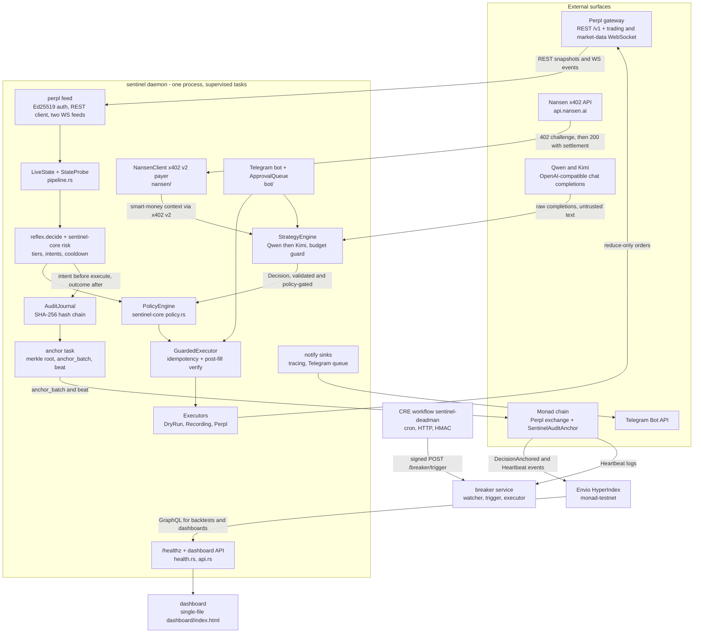
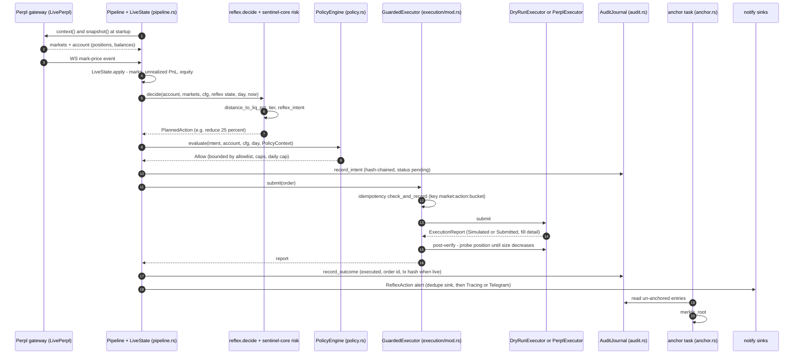
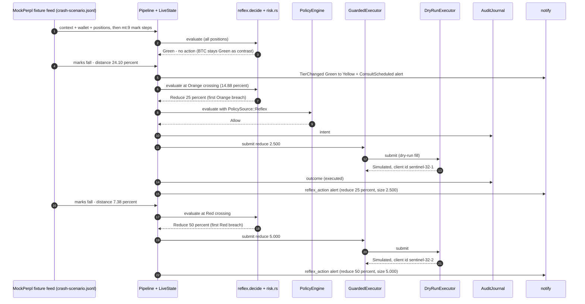
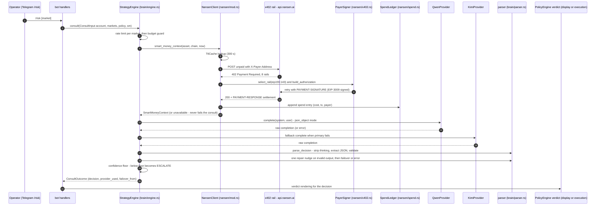
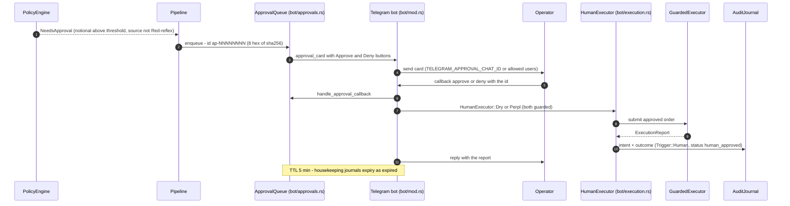
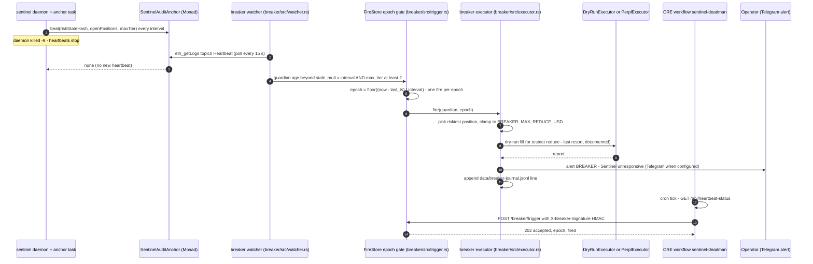
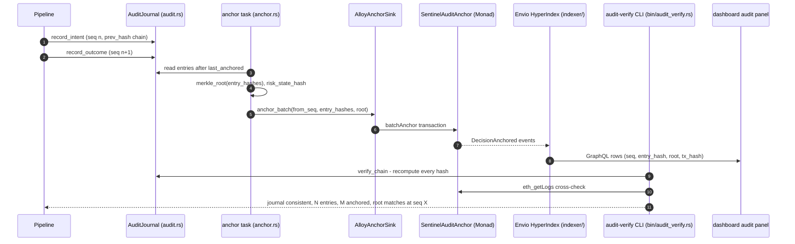

# Sentinel — Architecture

**Status:** v1.0 — full rewrite of the P02 v0 skeleton (v0 preserved in spirit), frozen
outline per [SPEC-P17](../SPEC-P17.md) §3. Architecture as shipped through P16, 2026-10-06.
**Number rule:** every measured value below links its `docs/evidence/` file; live-status
labels (`PENDING-KEY`, `PENDING-WALLET`, `PENDING-ACCOUNT`, `PENDING-TOKEN`) follow
[STUBS.md](STUBS.md) and are never upgraded speculatively.

**Document map:**
[FACTS.md](FACTS.md) — verified venue/chain facts ·
[STUBS.md](STUBS.md) — loud-stub registry ·
[RUNBOOK.md](RUNBOOK.md) — operations ·
[SETUP-MANUAL.md](SETUP-MANUAL.md) — human setup steps ·
[backtest-report.md](backtest-report.md) (+ [.json](backtest-report.json)) — capital-saved results ·
[telegram-manual-test.md](telegram-manual-test.md) — bot acceptance checklist ·
[`docs/evidence/`](evidence/) — the raw evidence corpus every number traces to.

Sentinel is a **verifiable AI risk guardian** for isolated-margin perpetual futures on
Perpl (Monad). It is not a trading bot: it never opens or grows exposure. It watches,
decides, and defensively de-risks — reduce-only orders or collateral additions only —
and every decision is journaled into a SHA-256 hash chain and anchored on Monad, so it
is provable after the fact by anyone with the local journal and `eth_getLogs`.

## 1. System diagram



*Fallback (plain text):* Perpl's REST+WS feeds enter a single supervised daemon; the
pure core (reflex risk math, policy, audit chain) sits at the center; every action leaves
through the guarded executor (reduce-only) back to Perpl; the LLM strategy brain is a
side input that must pass the same policy gate; the x402 Nansen client is the brain's
paid data source; the hash-chained journal is anchored on Monad; the Envio indexer
mirrors anchors back for dashboards and backtests; the breaker service and the Chainlink
CRE workflow form an independent dead-man's switch that can de-risk when the daemon is
unresponsive; the Telegram bot and the single-file dashboard are the operator surfaces.

## 2. The five pillars

The product rests on five load-bearing capabilities. Each pillar names the code that
delivers it and the evidence that proves it today.

1. **Speed — deterministic reflex.** `crates/sentinel-core/src/risk.rs` (liquidation
   math, tier classification, intent rules) driven by `crates/sentinel/src/reflex.rs::decide`.
   Measured: **0.271 µs/iteration** (10,000 iterations in 2.707756 ms; 2,200 intents) —
   [p04-skill-verification.txt](evidence/p04-skill-verification.txt). This path never
   calls an LLM.
2. **Judgment — dual brain.** `crates/sentinel/src/brain/` — a schema-validated LLM
   consult (`StrategyEngine`, Qwen primary → Kimi fallback, circuit breakers, budget
   guard). Judgment is advisory-by-construction: every LLM `Decision` re-enters the same
   policy gate and the same reduce-only sizing as reflex actions.
3. **Trust — hash-chained audit trail.** `crates/sentinel-core/src/audit.rs` (canonical
   JSON entries, `prev_hash`/`entry_hash` chain) + `contracts/src/SentinelAuditAnchor.sol`
   + `crates/sentinel/src/anchor.rs` + the `audit-verify` CLI. Proven end-to-end on a
   local chain: "✅ journal consistent; 5 entries; 5 anchored; root matches at seq 5" —
   [p10-anvil-e2e.txt](evidence/p10-anvil-e2e.txt); mirrored to GraphQL by the Envio
   indexer ([p12-envio-anvil.txt](evidence/p12-envio-anvil.txt)).
4. **Resilience — independent dead-man's switch.** `crates/breaker` (watcher → trigger →
   executor) plus the Chainlink CRE workflow `workflow-cre/sentinel-deadman`. Fires only
   when a guardian's last anchor Heartbeat is stale **and** critical, at most once per
   epoch, dry-run by default. Demo: HTTP 202 `{"accepted":true,"epoch":3,"fired":true}`
   and a dry-run reduce journaled at `0.635` size / `999.109` notional —
   [p14-breaker-demo.txt](evidence/p14-breaker-demo.txt).
5. **Evidence — measured, reproducible results.** The backtester
   (`crates/sentinel/src/sim/` + `crates/sentinel/src/bin/backtest.rs`) over 14 scenarios
   (12 synthetic + 1 recorded + 1 reconstructed, [backtest-report.md](backtest-report.md)),
   deterministic fixture replay (`scripts/crash-demo.sh`), and the evidence corpus itself.
   Headline, frozen literal: "Across 14 scenarios representing $60163.365 notional,
   Sentinel preserved $5972.13546111693125 (9.93%); baseline liquidations: 11 -> with
   Sentinel: 0" — [backtest-report.md](backtest-report.md).

## 3. Architecture invariants (never violated)

1. **The reflex never calls an LLM.** The risk core is pure (no I/O, no clock reads —
   `now_ms` is caller-supplied, SPEC-P04 §1); `reflex::decide` is synchronous and has no
   network types in scope. The crash demo runs its full tier cascade with no provider
   keys at all — [p06-crash-demo.clean.txt](evidence/p06-crash-demo.clean.txt).
2. **The LLM never bypasses the policy gate.** `PolicyEngine::evaluate`
   (`crates/sentinel-core/src/policy.rs`, SPEC-P05 §3) runs on every planned action,
   reflex- or strategy-sourced (`PolicySource::{Reflex, Strategy, Manual}`). The single
   documented asymmetry — a Red reflex action may bypass the *approval threshold*, never
   the notional cap or the daily cap — is explicit and tested
   ([SPEC-P05](../SPEC-P05.md) §3 rule 7, §8).
3. **Audit-before-action, hash-chained journal.** The pipeline journals the *intent*
   (`execution: {"status":"pending"}`) **before** any submission and the outcome after;
   no-order paths journal immediately (denied / needs_approval / none). Journal failure
   logs and proceeds — a rescue action outranks audit availability — and P16 adds an
   in-memory degrade mode with recovery flush (SPEC-P10 §8; [SPEC-P16](../SPEC-P16.md) §2).
4. **All external I/O behind mockable async traits + first-class `DRY_RUN`.** The seams:
   `PerplFeed` (`crates/sentinel/src/perpl/mod.rs`), `Executor` + `PositionProbe`
   (`crates/sentinel/src/execution/mod.rs`), `AnchorSink` (`crates/sentinel/src/anchor.rs`),
   `Provider` (`crates/sentinel/src/brain/providers.rs`). Implementations swap live/mock/
   recording/dry-run; `--replay` runs the whole pipeline offline with zero keys.
5. **`sentinel-core` has ZERO network dependencies.** The pure core (domain types, risk
   math, policy, audit chaining) has no network stack and no async runtime; `std::fs` is
   allowed only for journal persistence (SPEC-P10 §3). This is why the backtester lives in
   the app crate (`sentinel::sim`, SPEC-P13 §0), not the core.
6. **Secrets never logged; `SecretString` redaction.** Config secrets are wrapped in
   `config::SecretString` with hand-written redacted `Debug`; `ApiKeySigner` (Perpl auth)
   and `PayerSigner` (x402) implement `Debug` by hand; the P16 audit proves `Debug` of
   `Config`/`NansenConfig`/`PerplConfig`/`ApiKeySigner` never contains secret values, and
   a secret-scan suite scans `docs/evidence/*.txt`, logs and fixtures ("secret scan: 73
   files clean") — [p16-verify.txt](evidence/p16-verify.txt) §5.

## 4. Dual-brain rationale

Sentinel needs two decision timescales:

- **Reflex (deterministic, µs-scale).** Classification is measured at **0.271 µs per
  iteration** (10,000 iterations in 2.707756 ms, 2,200 intents generated) —
  [p04-skill-verification.txt](evidence/p04-skill-verification.txt). It is a pure
  function of (position, market, thresholds, injected clock): distance-to-liquidation,
  tier (Green/Yellow/Orange/Red with `>=` cuts at soft/warn/hard — defaults 25/15/8,
  [.env.example](../.env.example)), and intent rules with cooldown and first-breach
  escalation.
- **Strategy (LLM, seconds-scale).** The `StrategyEngine` buys judgment — regime reads
  ("is this a wick or a trend?"), smart-money context, escalation calls — and is
  strictly bounded: schema-validated output, one repair nudge, confidence floor below
  which the decision is rewritten to `ESCALATE`, and consult/token budget guards whose
  breach also returns a synthetic `ESCALATE` (SPEC-P07 §6, SPEC-P08 §3).

**The numbers, honestly labeled.** Live LLM latency is **unmeasured — PENDING-KEY**
(the operator's Qwen/Kimi keys are placeholders; the mock harness rows record `(0ms)`
because they are mock runs — [p07-brain-eval-mock.txt](evidence/p07-brain-eval-mock.txt);
live `brain_eval` is STUB-01/02). The design bound is the **60 s provider timeout**
(SPEC-P07 §3): the guard can never wait on a provider longer than that per attempt, and
the reflex path must never wait on it at all. That bound is ~2.2 × 10^8 times the
measured 0.271 µs classification per iteration — the entire reason the dual brain is
split at compile time: reflex decisions cannot depend on the LLM's availability,
latency, or output.

Failover keeps judgment alive when a provider dies: ordered chain [Qwen → Kimi] with
per-slot circuit breakers (open after 3 failures, 5-minute window, half-open probe) and
failover on HTTP/timeout/invalid-output/validation failures. Offline proof with
`FORCE_PROVIDER_FAIL=qwen`: every eval row PASSes with `provider=kimi` (14/14) —
[p08-failover.txt](evidence/p08-failover.txt). Live failover remains **PENDING-KEY**.

## 5. Data-flow walkthroughs (sequence diagrams)

The six flows below are the system's load-bearing paths. Component names are the real
code paths; every claim of liveness maps to [STUBS.md](STUBS.md).

### 5.1 Happy path — steady-state evaluation and a normal guarded execution



*Fallback (plain text):* the feed feeds a shared `LiveState`; each evaluation runs the
pure reflex, then the policy gate, then journals the intent; the guarded executor
deduplicates, submits, and post-verifies against a position probe; the outcome is
journaled and alerts fan out; the anchor task independently batches new journal entries.
The replay variant of this path is byte-deterministic (same fixture + config ⇒ identical
`PipelineOutcome::to_jsonl()`, SPEC-P06 §6; determinism gate
[p06-validate-test.txt](evidence/p06-validate-test.txt)).

### 5.2 Reflex save — the crash scenario (no LLM anywhere in the path)



*Fallback (plain text):* on the crash fixture the tier flips Green → Yellow → Orange →
Red; the reflex fires a 25 % reduce at Orange and a 50 % reduce at Red entirely inside
the deterministic core — no provider, no network; the two fills and the alert texts are
the recorded transcript — [p06-crash-demo.clean.txt](evidence/p06-crash-demo.clean.txt)
("ETH#32 reduce 25% · size 2.500 · sentinel-32-1 · simulated"; "ETH#32 reduce 50% · size
5.000 · sentinel-32-2 · simulated"). Cooldown gating and the Yellow→consult-scheduled
alert are visible in the same transcript. The 14-scenario backtest replays this same
production path with the same core functions — [backtest-report.md](backtest-report.md).

### 5.3 Strategy consult with an x402 purchase



*Fallback (plain text):* a consult is rate-limited per market and budget-guarded
(hourly consults + daily tokens, both defaulted in `crates/sentinel/src/config.rs`), then
optionally buys Nansen smart-money data over x402 v2: the client parses the live 402
challenge, selects the Monad rail (`eip155:143`, USDC), signs an EIP-3009
`TransferWithAuthorization` (EIP-712) and retries with `PAYMENT-SIGNATURE`, recording
cost + tx in the spend ledger; the LLM call is one request with one retry on 5xx, a
single repair nudge on unparseable output, and a Qwen → Kimi failover fallback.
**Liveness labels:** the free leg of the x402 flow is live-verified ("8 rail(s) ... Monad
rail selected", [p09-x402-check.txt](evidence/p09-x402-check.txt)); the paid call is
**PENDING-WALLET** (STUB-16); live Qwen/Kimi calls are **PENDING-KEY** (STUB-01/02) —
mock-harness scoreboard: action-class accuracy (core) 12/12, schema validity 14/14,
injection schema validity 2/2, grounding 14/14
([p07-brain-eval-mock.txt](evidence/p07-brain-eval-mock.txt)); automatic pipeline
triggers (Yellow entry / post-reflex / periodic review, `STRATEGY_REVIEW_INTERVAL_SECS`) are wired through the P20 consult task; the manual
`/risk` path stays available (`crates/sentinel/src/bot/handlers.rs`).

### 5.4 Approval flow — a human decides, then the same guard executes



*Fallback (plain text):* the pure policy gate emits `NeedsApproval`; the queue mints a
deterministic id and the bot sends Approve/Deny buttons; an approve executes through the
*same* guarded executor under `Trigger::Human` and journals both intent and outcome; a
deny or a 5-minute expiry journals `denied` / `expired`. All logic is proven offline
([p11-adversarial](../crates/sentinel/tests/p11_adversarial.rs)); the live checklist needs
the real bot token — **PENDING-TOKEN** (STUB-18).

### 5.5 Breaker save — the independent dead-man's switch



*Fallback (plain text):* outage detection is independent of the daemon: the breaker
watches anchor Heartbeats on-chain, fires once per epoch only when the guardian is stale
and critical, picks the riskiest position, clamps the reduce to the configured USD cap,
executes dry-run by default and alerts. The CRE workflow drives the same HTTP trigger
with an HMAC-signed POST when its cron sees a stale+critical status. Demo evidence:
`kill -9` then `POST /breaker/trigger -> HTTP 202 {"accepted":true,"epoch":3,"fired":true}`,
journal `"size": 0.635` / `"notional_usd": 999.109`, alert literal "BREAKER: Sentinel
unresponsive" — [p14-breaker-demo.txt](evidence/p14-breaker-demo.txt). CRE
`simulate` is **PENDING-ACCOUNT** (STUB-03) with an executed local-runner fallback over
the same `src/core.ts` definition — [p14-cre-simulate.txt](evidence/p14-cre-simulate.txt).

### 5.6 Audit anchor + verify — the Trust beat



*Fallback (plain text):* intents and outcomes are chained locally; the anchor task
merkle-roots the un-anchored tail and batches it on-chain (`batchAnchor`), while a
`beat()` heartbeat keeps the dead-man's switch fed; the Envio indexer mirrors events for
dashboards/backtests; `audit-verify` recomputes the chain and cross-checks the chain
against `eth_getLogs`. Verified on a local anvil end-to-end run: "✅ journal consistent;
5 entries; 5 anchored; root matches at seq 5" —
[p10-anvil-e2e.txt](evidence/p10-anvil-e2e.txt); `kill -9` crash safety rehearsed —
[p10-crash-safety.txt](evidence/p10-crash-safety.txt); testnet deploy remains
**PENDING-WALLET** (STUB-17).

## 6. Deployment, sharding & cost model

### 6.1 Process topology

- **One `sentinel` daemon** runs the pipeline plus supervised auxiliary tasks
  (`supervisor::spawn` — panics are caught, logged, and restarted with backoff; no single
  auxiliary task death kills the daemon; `crates/sentinel/src/supervisor.rs`, SPEC-P16 §2)
  and serves `/healthz` + the dashboard/API surface on `PORT` (default 8080).
- **One `breaker` process** (`crates/breaker`) watches the anchor contract over RPC and
  serves the armed surface on `BREAKER_PORT` (default 9090).
- **One image, two commands**: `docker-compose.yml` runs both from the same image
  (non-root `sentinel` user, `HEALTHCHECK` on `/healthz`, shared `./data:/app/data`
  volume); `railway.toml` is the deploy contract (Railway deploy is **PENDING-ACCOUNT**,
  STUB-24). Image digest `bdfa6a107a11` (reproducible) and compose journal seq-continuity
  "seq=45 (expected 45)" — [p16-docker.txt](evidence/p16-docker.txt),
  [p16-verify.txt](evidence/p16-verify.txt).
- **The dashboard is served by the daemon** from a single file
  (`dashboard/index.html`): no CDN, no fonts, no images, and the P15 verifier test
  enforces no external URLs outside comments; the live browser pass measured
  `GET / -> 61807 bytes` with a live kill-switch pause/resume round-trip —
  [p15-validate.txt](evidence/p15-validate.txt).

Execution modes (fail-fast validated at load, [RUNBOOK.md](RUNBOOK.md) §2):

| Mode | Orders | Use |
|---|---|---|
| `DRY_RUN` | simulated fills at mark ± slippage bps | development, tests, demo replay |
| `TESTNET` | live reduce-only orders on Monad testnet | validation when keys land (PENDING-KEY live leg) |
| `MAINNET` | refused by the daemon: "mainnet is not wired yet" | roadmap only |
| `--replay` | none — deterministic fixture + logical clock | zero-key smoke, judges, CI |

Live modes must be consistent with `PERPL_ENV`; `MAINNET` additionally requires
`I_UNDERSTAND_MAINNET_RISK=yes` but still does not start (not wired — deliberate).
DRY_RUN acceptance is recorded end-to-end: a 25 % reduce fills at `2710.98630` (python
slippage crosscheck, mark 2713.70 at 10 bps sell) and the repeat intent is suppressed as
a duplicate (window 60 s, key `32:reduce:250`) — the idempotency guard is the retry
mechanism, at-most-once — [p05-dryrun-acceptance.txt](evidence/p05-dryrun-acceptance.txt).

### 6.2 Scaling: stateless reflex sharding by account

The reflex decision is a **pure function** of (account snapshot, market table, config,
per-market reflex bookkeeping, caller-supplied `now_ms`): no wall-clock reads inside
replay decisions, no hidden globals (the determinism gate replays identical JSONL,
[p06-validate-test.txt](evidence/p06-validate-test.txt)). That is what makes the
guard **shardable by account**:

- **Shard unit = one guarded account.** Each shard is one daemon process bound to one
  Perpl account (`PERPL_ACCOUNT`) with its own data directory: journal
  (`data/audit/`), idempotency store (`data/idempotency.json`), heartbeat status,
  Nansen spend ledger, policy overlay. Shards share nothing at runtime — horizontal
  scale is "run more shards", and a failing shard cannot corrupt another account's state.
- **One writer per journal is a design rule** (never run two writers over one `data/`
  dir; a violated run forked a chain at seq 41 and was repaired/disclosed —
  [p16-verify.txt](evidence/p16-verify.txt) §6.2, [RUNBOOK.md](RUNBOOK.md) §5).
- **One breaker can cover N guardians**: `BREAKER_GUARDIANS` is a CSV of addresses and
  the watcher tracks the latest Heartbeat per guardian; `POST /breaker/trigger` is
  per-guardian.
- **Trait seams for future scale-out and venue swaps**: `PerplFeed` (venue in/out),
  `Executor` + `PositionProbe` (order out / truth back), `AnchorSink` (chain), `Provider`
  (LLM). All are generic async traits without `dyn` — a second venue or a remote executor
  is an implementation, not a rewrite (SPEC.md (P03) §4, SPEC-P05 §5).

### 6.3 Cost model per guarded account (modeled estimate — assumptions listed)

All prices are **list prices fetched 2026-10-06** from the cited pages; everything else
is an assumption listed below. This whole subsection is a **modeled estimate**, not a
measured bill.

| Component | Cited list price | Assumption (per account) | Arithmetic | $/day |
|---|---|---|---|---|
| Railway RAM | $0.00000386 / GB / sec ([railway.com/pricing](https://railway.com/pricing)) | 0.5 GB working set | 0.5 × 0.00000386 × 86400 | 0.166752 |
| Railway CPU | $0.00000772 / vCPU / sec (same) | 5 % of one vCPU average | 0.05 × 0.00000772 × 86400 | 0.0333504 |
| Railway volume | $0.00000006 / GB / sec (same) | 0.1 GB journal + state | 0.1 × 0.00000006 × 86400 | 0.0005184 |
| Railway egress | $0.05 / GB (same) | 0.05 GB/day | 0.05 × 0.05 | 0.0025 |
| Envio HyperIndex | Development $0 / month; Production $70–$800 / month ([envio.dev/pricing/hosting](https://envio.dev/pricing/hosting)) | dev tier for backtests/dashboards | 0 | 0 |
| HyperSync | Free tier $0 (fair-use); Starter $70 / Pro $480 per month ([envio.dev/pricing/hypersync](https://envio.dev/pricing/hypersync)) | free-tier queries | 0 | 0 |
| Monad public RPC | $0 public endpoints, rate-limited (e.g. testnet QuickNode 50 rps) ([docs.monad.xyz/developer-essentials/testnet](https://docs.monad.xyz/developer-essentials/testnet)) | low-rate reads | 0 | 0 |
| Nansen x402 data | $0.05 / smart-money call, Monad rail amount 50000 at 6 dec ([p09-x402-check.txt](evidence/p09-x402-check.txt), FACT sheet row) | 12 paid calls/day typical | 12 × 0.05 | 0.60 |
| LLM tokens | **not priced — PENDING-KEY** (STUB-01/02; model strings unverified) | excluded from the model | — | — |

**Modeled totals.** Compute floor: 0.166752 + 0.0333504 + 0.0005184 + 0.0025 =
**$0.2031208/day ≈ $6.09 per 30 days**; net of the Railway Hobby $5/month usage credit
≈ **$1.09/month**. With typical data spend: 0.2031208 + 0.60 = **$0.8031208/day ≈
$24.09 per 30 days per guarded account** — i.e. **~$0.80/day per account** all-in, before
LLM tokens (PENDING-KEY) and before any paid tiers. Guardrail ceiling: the Nansen budget
guard caps paid calls at the configured `NANSEN_MAX_CALLS_PER_HOUR` (default 40): a
saturated day would be 40 × $0.05 × 24 = **$48/day** of data spend — the guard exists
precisely so that ceiling is a configuration accident, not a market event.

**Assumptions list (all modeled):** one account per shard; steady-state 0.5 GB RAM /
5 % vCPU; 0.1 GB volume; 0.05 GB/day egress; ~12 smart-money calls/day with the 300 s
TTL cache doing little work at that cadence; LLM token cost excluded (PENDING-KEY);
one region; no Railway Pro/Enterprise add-ons; Envio/HyperSync/Monad RPC at free/public
tiers (Envio production $70–$800/month if the indexer must be a hosted production
service; HyperSync Starter $70/month if free fair-use is exceeded); volume geometry and
egress are estimates, not measurements. **The data plane is Envio**: HyperSync feeds and
HyperIndex stores anchor/Perpl events for backtesting and dashboards — the local anvil
end-to-end (realtime indexing of a live seq=3 anchor,
[p12-envio-anvil.txt](evidence/p12-envio-anvil.txt)) is the standing proof; cloud
deploy is **PENDING-ACCOUNT/WALLET** (STUB-20); full Perpl exchange event indexing is
**ROADMAP** (STUB-21).

## 7. Security & threat model

**Trust boundaries.** Everything crossing a boundary is untrusted input: venue frames
(REST/WS), LLM completions, Nansen responses, Telegram messages, RPC results, and the
filesystem under `data/`. The design principle everywhere: *untrusted input can only
propose; the deterministic core disposes, and the human stays in every dangerous loop.*

| # | Threat | Mitigation | Status / evidence |
|---|---|---|---|
| 1 | Stolen API/LLM/signer keys | Secrets live only in env (`.env` gitignored — [.gitignore](../.gitignore); excluded from image/compose context); no hot reload, rotate = restart ([RUNBOOK.md](RUNBOOK.md) §3); redacted `Debug` everywhere; secret-scan + redaction-audit test suites | Proven (scan "73 files clean"; redaction tests green) — [p16-verify.txt](evidence/p16-verify.txt) §5; mainnet tier planned (below) |
| 2 | Prompt injection via market data, SM context, or venue strings | LLM output is schema-validated and grounded: numbers in `reason` must appear in the prompt; market ids restricted to the allowlist; unknown fields tolerated but required fields typed; the LLM cannot reach the executor — only the policy gate can | Injection scenarios (rows 13/14) schema-valid + grounded; core accuracy 12/12 — [p07-brain-eval-mock.txt](evidence/p07-brain-eval-mock.txt), [p08-failover.txt](evidence/p08-failover.txt); live eval PENDING-KEY |
| 3 | Rogue or wrong LLM decision | Every strategy decision passes `PolicyEngine` + reduce-only sizing (quantize-down, never exceeds position); confidence floor downgrades low-confidence output to `ESCALATE`; budget guard → synthetic `ESCALATE`; one repair nudge, then failover | SPEC-P05 §3-4, SPEC-P07 §6, SPEC-P08 §3; adversarial suites ([chain_adversarial](../crates/sentinel/tests/chain_adversarial.rs), [brain_adversarial](../crates/sentinel/tests/brain_adversarial.rs)) |
| 4 | Stale/absent/wrong feed data | Edge-triggered staleness detector; `stale_reduce=false` default ⇒ stale Orange/Red alerts humans instead of acting blind; reconnect with backoff ≤ 30 s; every decision carries its data-quality class | SPEC-P04 §3.4, SPEC.md (P03) §4; WS storm test (10 kill cycles) green — [p16-verify.txt](evidence/p16-verify.txt) |
| 5 | Total daemon failure (process death, host loss) | Independent dead-man's switch: on-chain Heartbeat cadence watched by `crates/breaker`; fires once per epoch, dry-run by default, capped notional; CRE workflow drives the same HMAC-gated endpoint | [p14-breaker-demo.txt](evidence/p14-breaker-demo.txt); HMAC spec vector independently reproduced — [p14-validate.txt](evidence/p14-validate.txt); CRE simulate PENDING-ACCOUNT |
| 6 | Operator misuse (Telegram / dashboard) | Bot is allowed-user-only; `/pause` requires typed `PAUSE` confirmation; dashboard mutations require `DASHBOARD_ADMIN_KEY` (constant-time compare; unset ⇒ 503); approval queue TTL 5 min; policy overlay is whitelist-validated with atomic writes | [p16-verify.txt](evidence/p16-verify.txt) §3 ("rate limit probe: ok=120 limited=90"; 503/401/200 matrix); [p11_adversarial](../crates/sentinel/tests/p11_adversarial.rs) |
| 7 | Journal tampering or loss | Hash chain detects any edit (tamper matrix catches the exact seq); anchors make the chain externally checkable; degrade mode keeps in-flight order flow alive and flushes on recovery; `kill -9` rehearsal proves resume | SPEC-P10; [p10-crash-safety.txt](evidence/p10-crash-safety.txt), [p16-verify.txt](evidence/p16-verify.txt) §2 |
| 8 | x402 spend abuse / payer drain | Payer key isolation (below); hourly call budget as the single gate; spend ledger is the source of truth; 300 s cache; dashboard spend panel | [p09-x402-check.txt](evidence/p09-x402-check.txt); low-balance alert deferred (STUB-25, needs the live wallet) |

**Key custody tiers (what protects what, today vs mainnet).**

- **Tier 0 — shipped placeholders.** `.env.example` ships placeholders; the daemon
  fail-fast-validates presence/shape but placeholder credentials make live modes exit at
  the first signed call (RUNBOOK §1.1). Nothing real is committed: `.env` and `.env.*`
  are gitignored (except the example), and the Docker build never sees `.env`.
- **Tier 1 — process-local env secrets.** Perpl API key/secret (Ed25519, scopes
  read/trade), `QWEN_API_KEY` / `KIMI_API_KEY`, `TELOXIDE_TOKEN`, `NANSEN_PAYER_KEY`,
  `RPC_SIGNER_KEY`, `BREAKER_ARM_SECRET`, `DASHBOARD_ADMIN_KEY` — all read once at
  startup, rotated by restarting the affected process (RUNBOOK §3 lists each key's
  rotation procedure).
- **Tier 2 — in-memory redaction.** `SecretString` and the hand-written `Debug` impls
  (`ApiKeySigner`, `PayerSigner`, `AlloyAnchorSink`); the redaction-audit test proves no
  `Debug` output leaks values (SPEC-P16 §3).
- **anvil-dev vs real keys.** Demos and tests (breaker demo, anvil e2e, P09 oracles) use
  the well-known **public Foundry dev keys** — the secret scanner explicitly exempts
  "the two documented public Foundry dev keys" while still flagging non-public 64-hex
  material in key contexts ([p16-verify.txt](evidence/p16-verify.txt) §5); the demo
  keys are labeled as such and are never funded beyond local anvil. Funded keys are the
  PENDING ones: `NANSEN_PAYER_KEY` (**PENDING-WALLET**, STUB-16), `RPC_SIGNER_KEY`
  (**PENDING-WALLET**, STUB-17). The scan strengthens automatically when real values land.

**Policy envelope (the single choke point).** Every order-shaped intent — reflex,
strategy, or human — passes `PolicyEngine::evaluate` with first-failure-wins precedence:
kill switch → market allowlist → position resolution → reduce-only invariants (fraction
bounds, flat-position close denial, positive collateral) → notional cap
(`MAX_ORDER_SIZE_USD`) → approval threshold (`REQUIRE_APPROVAL_ABOVE_USD`, with the
narrow Red-reflex asymmetry) → daily action cap. Sizing is a pure function that can only
shrink a position (quantize-down to lot grid, clamp to position; SPEC-P05 §4). No intent
variant can increase exposure or flip a side — by construction, advertised and tested.

**Prompt-injection results (from the fact sheet).** The eval suite carries 14 scenarios
(12 core, 2 injection); the two injection scenarios are **rows 13/14**
(`13-injection-symbol`, `14-injection-note`) and both pass schema validity and grounding
— "injection schema validity: 2/2" — while core action-class accuracy is **12/12**; the
failover scoreboard shows every row PASS with `provider=kimi`, **14/14**
([p07-brain-eval-mock.txt](evidence/p07-brain-eval-mock.txt),
[p08-failover.txt](evidence/p08-failover.txt)). These are mock-harness results;
live-mode results are **PENDING-KEY**.

**x402 payer isolation.** The x402 payer is a *separate* key (`NANSEN_PAYER_KEY`, the
PENDING-WALLET wallet) — never the Perpl trading key and never the anchor signer; its
worst-case exposure per request is one EIP-3009 authorization bounded by
`validBefore = now + maxTimeoutSeconds` (+60 s clock skew) and a random 32-byte nonce;
the spend ledger records every settlement; nothing in the flow logs key material or
signature bytes beyond what the tests race adversarially (SPEC-P09 §3, §7). The EIP-712
digest `0xab74a1066d05d2a495f2d5938ba4db686a7039cbf63cd6e456a2f11c641c0951` is pinned in
`crates/sentinel/tests/nansen_adversarial.rs` and produced by the independent ethers-6.17
oracle `tests/fixtures/nansen/eip712_oracle.js` (test
`eip712_signature_matches_independent_oracle` green —
[p09-validate-test.txt](evidence/p09-validate-test.txt)).

**Kill switch, rate limits, admin key.** The kill flag is a shared `AtomicBool` read by
the policy gate on every evaluation ("kill switch engaged" deny) and flippable from two
operator surfaces: Telegram `/pause` (typed confirmation) and the dashboard's
`POST /api/pause|resume` (admin key required, constant-time compare; unset key disables
mutations). `/api/*` is rate-limited by a hand-rolled per-IP token bucket (60/min, burst
120 → 429; `/healthz` and `GET /` exempt), re-verified black-box in P16
([p16-verify.txt](evidence/p16-verify.txt) §3).

**Mainnet plan (ROADMAP — nothing here is shipped).** (1) signing custody moves from raw
hot keys to **MPC / session keys** with policy-scoped delegation; (2) a **funded deploy**
sequence: fund accounts, deploy `SentinelAuditAnchor` on Monad mainnet, enable the anchor
task, then enable live reduce-only execution behind the existing mode gates; (3) an
**external audit** of the policy core, executor guard, and contracts; (4) staged
enablement checklist per RUNBOOK §2/§7 with monitoring (heartbeat freshness, spend
ledger, breaker arming). Everything live today is testnet/anvil/DRY_RUN by design; the
daemon refuses `--mode mainnet`.

**Known limitations (kept loud).** One writer per journal (RUNBOOK §5) · venue minimum
order size not exposed — clamp dormant (STUB-10) · funding-drag term not modeled
(STUB-06) · no reprice retry after a post-verify timeout (STUB-13) · backtest
`live-brain` hook unwired — fails honestly (STUB-22) · x402 low-balance alert deferred
(STUB-25) · Telegram retries inherit teloxide's ~10 s per-attempt server-error delay
(~45 s to abandon) while connection failures use the 0.5 s base (RUNBOOK §5 note) ·
live LLM latencies and live evaluates are unmeasured pending keys.

## 8. Evidence, labels & reproduction

**PENDING register (all labels mirror [STUBS.md](STUBS.md) — nothing graduates
without its exit criterion).**

| Surface | Label | Ref |
|---|---|---|
| Live Qwen/Kimi calls + live brain eval | PENDING-KEY | STUB-01/02 |
| Perpl testnet key (live read, recording, live reduce) | PENDING-KEY | STUB-09/12 |
| x402 paid smoke ($0.01 / $0.05 call) | PENDING-WALLET | STUB-16 |
| Anchor testnet deploy + live anchors | PENDING-WALLET | STUB-17 |
| BREAKER/CRE simulate, supported-chains, registration | PENDING-ACCOUNT | STUB-03 |
| Envio Cloud deploy + live Monad rows | PENDING-ACCOUNT/WALLET | STUB-20 |
| Railway deploy | PENDING-ACCOUNT | STUB-24 |
| Telegram live acceptance checklist | PENDING-TOKEN | STUB-18 |
| Public URLs (dashboard, Railway, Envio Cloud, videos) | PENDING | STUB-20/24, RUNBOOK §7 |

**Reproduce everything (offline unless noted):**

```bash
bash scripts/validate.sh                 # fmt + clippy -D warnings + full test suite
scripts/crash-demo.sh                    # golden path: tier cascade + reflex saves (replay)
scripts/breaker-demo.sh                  # dead-man's switch over anvil (kill -9 -> fire)
scripts/docker-verify.sh                 # image build + compose + journal seq continuity
cargo run --release --bin backtest       # 14 scenarios -> docs/backtest-report.{md,json}
cargo run --release --bin audit-verify -- --no-chain   # verify the local hash chain
cargo run --release --bin brain_eval -- --mock         # offline scoreboard (live = PENDING-KEY)
```

**Engineering conventions (carried from the v0 skeleton).** *Latest versions:* toolchains
and crates track the live registries even when a spec quotes an older pin (Rust deps
resolved with `cargo add`; the toolchain file tracks `stable`; the MSRV floor only bounds
compatibility). *Fail-fast config:* `Config::load()` refuses to start on missing required
variables, invalid values, or broken invariants (`hard < warn < soft`, MAINNET
acknowledgement, secret hex length). *Evidence-first:* every prompt's validation output
is captured under `docs/evidence/` and mapped in [FACTS.md](FACTS.md) /
[STUBS.md](STUBS.md); a number without a traceable file is treated as a bug in
this document. *Full-suite gates:* 38 suites / 878 tests OK, clippy `-D warnings` rc=0,
fmt clean — [p16-validate.txt](evidence/p16-validate.txt).
